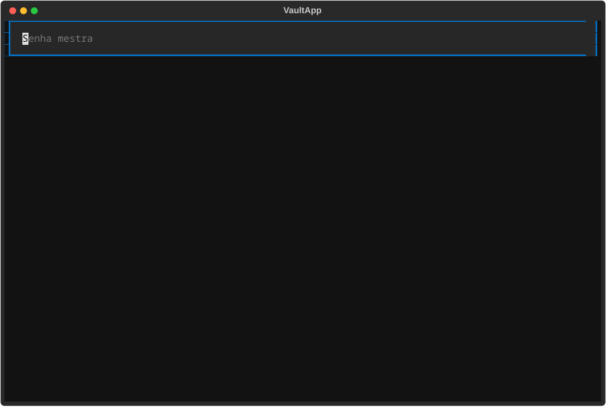

# Secure Vault

> Gerenciador de senhas local: a senha mestra nunca é armazenada, e o banco de
> dados é inútil para quem não a tiver.

## Sobre o projeto

Sistema de gerenciamento e geração de senhas seguras. Gera senhas fortes,
armazena-as criptografadas e as recupera mediante autenticação com uma senha
mestra — sem que a senha mestra ou as senhas armazenadas jamais toquem o disco em
texto puro.

Tudo roda localmente: não há servidor, conta, sincronização nem telemetria. O
único estado é o banco PostgreSQL que você controla.

## Motivação

<!-- TODO (Renan): duas ou três frases sobre por que você construiu isso e o que
     quis demonstrar. É a única seção que ninguém pode escrever por você. -->

## Arquitetura de segurança

É a parte que separa um "CRUD com senha" de um gerenciador de senhas de verdade.

| Garantia | Como é obtida | Onde está no código |
|---|---|---|
| A senha mestra nunca é armazenada | Só o hash **Argon2id** (formato PHC, salt próprio) é persistido | [`core/master_password.py`](src/vault/core/master_password.py) |
| A chave de criptografia nunca toca o disco | Derivada em memória a cada destravamento, a partir da senha mestra + salt do vault | [`core/kdf.py`](src/vault/core/kdf.py) |
| Todo segredo é cifrado antes do banco | **AES-256-GCM** (AEAD), blob versionado | [`core/crypto.py`](src/vault/core/crypto.py) |
| Nonce único por registro **e por gravação** | `secrets.token_bytes(12)` a cada operação de cifragem | `crypto.encrypt` |
| Adulteração do banco é detectada | A tag GCM autentica o texto cifrado; qualquer bit alterado falha | `crypto.decrypt` |
| Blob não pode ser movido de registro | *Associated data* fixa (`AAD_CREDENTIAL`) amarra o texto cifrado ao seu uso | `crypto.AAD_*` |
| **Serviço, login e URL também são cifrados** | Zero-Knowledge: a credencial inteira vira **um** blob opaco | `db/repository.py` |
| Senhas geradas são imprevisíveis | `secrets` (CSPRNG do SO), nunca `random` | [`core/generator.py`](src/vault/core/generator.py) |
| Um vault que não abre é detectado no login | Sentinela `key_check` cifrada, conferida antes de tocar dado real | `master_password.unlock` |
| Subir o custo do KDF não quebra vaults antigos | Os parâmetros de KDF são gravados **no vault**, não fixados no código | `vault_config.kdf_*` |

### Três decisões que valem explicação

**Os parâmetros do Argon2id ficam no banco, não no código.** Se estivessem no
código, o dia em que alguém subisse `time_cost` para endurecer o KDF, todo vault
já existente passaria a derivar uma chave diferente — e os dados ficariam
ilegíveis, sem nenhuma mensagem dizendo por quê. Gravados no vault, um vault
antigo abre com os parâmetros dele e um vault novo nasce com os novos.

**Separação de domínio por HKDF.** A senha mestra alimenta dois usos: o hash de
autenticação e a chave de criptografia. Eles já usam salts diferentes, o que
bastaria — mas "não são iguais por acidente do salt" é uma garantia frágil.
Passar a saída do Argon2 por um HKDF com rótulo fixo torna a separação explícita.

**AES-GCM em vez de Fernet.** Fernet é AES-128-CBC + HMAC; usaria só metade da
nossa chave de 256 bits e não tem *associated data*. Com GCM, além de cifrar, a
tag autentica — qualquer bit alterado no banco faz a abertura falhar em vez de
devolver lixo silenciosamente.

**Zero-Knowledge: a credencial inteira é um blob só.** Até 22/09/2026 o banco
guardava `service_name`, `login` e `url` em texto e cifrava apenas os segredos.
Hoje não guarda nada legível: a credencial inteira é serializada e cifrada sob
uma *associated data* única. Quem lê o banco vê identificador, datas e bytes.

⚠️ **Isso tem um preço, e ele é real:** listar e buscar passaram a **exigir a
senha mestra**, porque não há mais o que indexar. `vault list` decifra todas as
credenciais para poder mostrar o nome do serviço. Foi uma troca deliberada —
a versão anterior escondia menos e custava menos.

> **Escopo:** projeto educacional/portfólio. Não implementa proteção contra
> memory dumping, ataques de canal lateral ou hardening de sistema operacional.
> Ver "Limitações conhecidas".

## Stack tecnológica

| Camada | Escolha | Motivo |
|---|---|---|
| Linguagem | Python 3.12+ (via `uv`) | `requires-python = ">=3.12"` |
| Empacotamento | `uv` | resolução, lockfile e venv numa ferramenta só |
| Banco | PostgreSQL 16 | modelagem relacional, constraints reais, migrations |
| Driver | `psycopg` v3 (`binary`) | driver moderno, mantido, com caminho para `async` |
| ORM / migrations | SQLAlchemy 2 + Alembic | `Mapped[...]` tipado; migrations versionadas |
| Config | `pydantic-settings` | leitura tipada e validada de `.env` |
| Criptografia | `cryptography` (AES-256-GCM, HKDF), `argon2-cffi` | bibliotecas auditadas; nunca "rolar o próprio crypto" |
| CLI | `typer` + `rich` | subcomandos, help automático, saída legível |
| Força de senha | `zxcvbn` | estimativa de tentativas, não regra de tamanho |
| TUI | `textual` | interface rica sem sair do terminal |
| Extras | `pyperclip`, `pyotp` | clipboard com auto-clear, TOTP (RFC 6238) |
| Testes / lint | `pytest`, `ruff` | padrão do ecossistema |

## Estrutura do projeto

```
secure-vault/
├── src/vault/
│   ├── cli/          # comandos Typer (main.py) e sessão interativa (shell.py)
│   ├── core/         # domínio: crypto, kdf, master_password, generator,
│   │                 #          strength, totp, session, clipboard
│   ├── db/           # models, engine, session, repository, migrate
│   ├── tui/          # interface textual (Fase 9)
│   ├── config/       # settings tipadas
│   └── exceptions.py # hierarquia de erros do domínio
├── tests/
│   ├── unit/         # crypto, kdf, gerador, força, TOTP, sessão, settings
│   └── integration/  # vault, repositório, CLI, migrations (Postgres)
├── migrations/       # Alembic
├── docs/TUTORIAL.md  # explicação completa do que existe e por quê
└── .env.example
```

## Como rodar

Pré-requisitos: [uv](https://docs.astral.sh/uv/) e um PostgreSQL acessível.

```bash
git clone git@github.com:ReCroffi/secure-vault.git
cd secure-vault
uv sync --all-groups
cp .env.example .env          # preencher DATABASE_URL
docker compose up -d          # ou aponte para um Postgres que você já tenha
uv run vault db upgrade       # aplica as migrations
uv run vault init             # cria o vault e define a senha mestra
```

## Comandos

```bash
vault init                    # cria o vault (uma vez por banco)
vault status                  # parâmetros de KDF, cifra, total de credenciais
vault add github renan -g     # guarda uma credencial com senha gerada
vault list                    # lista (PEDE a senha mestra: no ZK, o nome do serviço está cifrado)
vault search git              # busca por serviço, login ou URL
vault get github --login renan  # copia a senha, com auto-clear
vault get github --show       # exibe em vez de copiar
vault update 1 --generate     # troca a senha por uma gerada
vault delete 1                # apaga (pede confirmação)
vault passwd                  # troca a senha mestra e re-cifra todo o vault
vault generate -l 32 -n 5     # gera senhas (não precisa de banco)
vault strength 'senha'        # avalia a força (não precisa de banco)
vault totp enable             # ativa segundo fator na senha mestra
vault shell                   # sessão interativa com timeout
vault tui                     # interface visual
vault db upgrade / db check   # migrations e teste de conexão
vault destroy                 # apaga o vault inteiro (pede senha + APAGAR TUDO)
```

Nenhuma senha é aceita como argumento de linha de comando: ela apareceria no
histórico do shell e na lista de processos. Tudo é lido com `getpass`. Para CI e
scripts existem `VAULT_MASTER_PASSWORD` (senha atual), `VAULT_NEW_MASTER_PASSWORD`
(apenas para `vault passwd`) e `VAULT_TOTP_CODE`.

Comandos destrutivos — `delete`, `destroy` e `passwd` — exigem a senha mestra.

### Interface TUI



## Testes

```bash
uv run pytest                                     # 255 passam + 12 pulados, sem dependências externas
uv run ruff check .
```

A suíte roda inteira em SQLite temporário — sem Docker, sem serviço, sem `.env`.
Os testes que exigem um PostgreSQL real (migrations, `CHECK`, `timestamptz`) são
marcados e pulados quando não há banco; para incluí-los:

```bash
TEST_DATABASE_URL=postgresql+psycopg://<USUARIO>:<SENHA>@localhost:5432/secure_vault uv run pytest
```

## Roadmap

- [x] Fase 0 — Setup do projeto e dependências (`uv`)
- [x] Fase 1 — Conexão com Postgres e configuração via `.env`
- [x] Fase 2 — Modelagem do schema + primeira migration (Alembic)
- [x] Fase 3 — Criação do vault (senha mestra, salt, hash)
- [x] Fase 4 — Autenticação e derivação de chave em memória
- [x] Fase 5 — CRUD de credenciais criptografadas via CLI
- [x] Fase 6 — Gerador de senha configurável
- [x] Fase 7 — Indicador de força de senha
- [x] Fase 8 — Busca/filtro de credenciais
- [x] Fase 9 — Interface TUI (`textual`)
- [x] Fase 10 — Timeout de sessão, clipboard com auto-clear, 2FA na senha mestra

As dez fases originais estão fechadas. O que veio depois — Zero-Knowledge, o
cliente web e o CRUD da TUI — está em **[`docs/ROADMAP.md`](docs/ROADMAP.md)**,
com o estado medido de cada frente.

## Limitações conhecidas

Declaradas de propósito. Um projeto de segurança que não lista o que **não**
protege está escondendo o modelo de ameaça.

1. **Buscar e listar exigem a senha mestra, e custam O(n) decifragens.** Desde a
   migração Zero-Knowledge de 22/09/2026 nada é legível no banco — nem o nome do
   serviço. O outro lado da mesma moeda: não há índice possível, então toda busca
   abre todas as credenciais em memória. Em vault pequeno é imperceptível; em
   vault muito grande, é o limite conhecido desta arquitetura.

   ⚠️ ~~Versão anterior: "Nome do serviço, login e URL ficam legíveis no banco.
   Só os segredos são cifrados."~~ **Deixou de valer** — está registrado porque
   quem criou um vault antes daquela data precisa saber que o formato mudou, e
   que a migration **recusa** converter vault com credenciais.
2. **A chave existe em memória enquanto o processo roda.** `bytearray` zerado ao
   trancar a sessão reduz a janela, mas o CPython pode ter feito cópias fora do
   nosso alcance, e a página pode ir para o swap. Não há proteção contra memory
   dumping.
3. **O TOTP não protege a cifra, protege o acesso.** O segredo TOTP é cifrado com
   a chave derivada da senha mestra — logo, quem tem a senha mestra pode derivar a
   chave e gerar códigos. O segundo fator barra quem descobriu a senha mas não tem
   o autenticador; não barra quem já tem o banco e a senha.
4. **Sem proteção contra canal lateral.** As comparações críticas usam
   `compare_digest`, mas não há defesa contra ataques de cache ou temporização
   mais finos.
5. **Sem limite de tentativas.** O custo do Argon2id (~200 ms) é a única barreira
   contra força bruta local. Não há bloqueio após N erros.
6. **A segurança do banco é sua.** O vault não protege contra alguém que apague o
   banco. Faça backup — e note que um backup do banco sem a senha mestra é inútil,
   o que é o objetivo, mas também significa que perder a senha mestra é perder tudo.
7. **`vault destroy` apaga tudo, e é irreversível.** Ele existe para que
   recomeçar seja um comando explícito em vez da instrução de dropar o banco na
   mão — que é como se apaga o banco errado. A confirmação exige a senha mestra
   **e** digitar `APAGAR TUDO`, mas depois disso não há como voltar atrás.

## Licença

MIT — ver [LICENSE](LICENSE).

## Autor

Renan Croffi

<!-- TODO (Renan): LinkedIn / GitHub / contato -->
